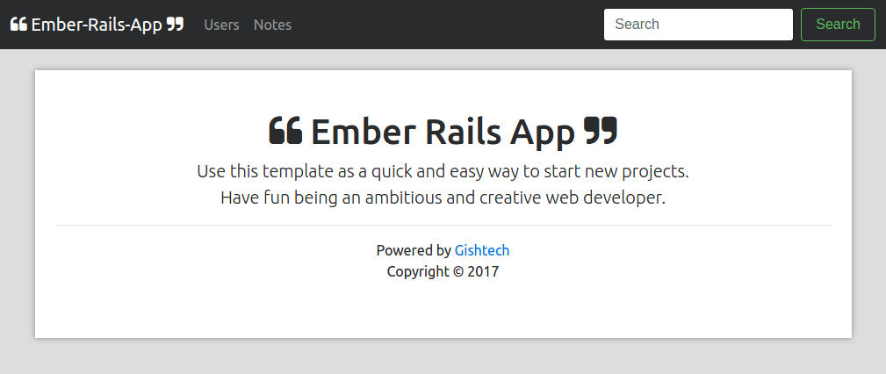

# Going the Extra Mile with Ember, Rails, JSON API and friends

This is a bare-bones template that you can use as a starting point for building your very own impressive ember-rails applications.

It goes well beyond the plain-vanilla templates which I've found in articles, which though very informative and useful to a degree, never go further than the basics.

Also included as part of the deal are concepts like error handling, pagination, CORS, authentication, securty and data relationships (the trickiest of all).

Using this approach as a generic basis, you can easily combine the power of the Rails backend with the flexibility of an Ember client interface.

I've also extended the template to use [Sass](http://sass-lang.com/) and [Bootstrap v4 alpha](https://v4-alpha.getbootstrap.com/), but this can be left out if you prefer.




## Installation from Github

This is the quick and easy way to get things running, meaning that you'll have an app which you can study and play around with.

However, if you really want to learn the details and understand how things work under the hood, the you should skip this section and proceed with the next one.

You will need to have the following tools installed:
* git
* ruby
* bundler
* ember-cli
* node
* npm
* bower

Assuming that you already have the above installed, here are the steps you need to follow.

Clone the repository to a local directory of your choice:

```
$ $ git clone https://github.com/kgish/ember-rails-template.git
$ cd ember-rails-template
```

Setup the Rails stuff:

```
$ bundle install
```

Initialize the database and populate it with some dummy data:

```
$ rails db:create
$ rails db:migrate
$ rails db:seed
```

Setup the Ember stuff:

```
$ cd frontend
$ npm install
$ bower install
```

You are now ready to launch the application:

```
$ cd ..
$ bundle exec rails server

```

Point your favorite browser at [http://localhost:3000](http://localhost:3000), cross your fingers and hope to die, and you should see the homepage of the screenshot above.


## Installation from scratch

The steps needed for a successful installation are easy, just follow these instructions closely. It is very important that you proceed exactly in the order given, otherwise you will run into unexpected problems.

### Rails API back-end

Install the new Rails application as usual. Since you will be using Ember for the front end, use the `--api` option for creating an API-only application.

```
$ rails new ember-rails-template -d postgresql --api
$ cd ember-rails-template
```

Enable CORS and add the following lines to the `Gemfile`:

```
gem 'rack-cors'

gem 'ember-cli-rails'
gem 'active_model_serializers', '~> 0.10.0'
```

Install it all:

```
$ bundle install
$ bundle exec rails db:create
```

Initialize the database and populate it with some dummy data:

```
$ rails db:create
$ rails db:migrate
$ rails db:seed
```

Change the origin and resource settings in the `config/initializers/cors.rb` to look like this:

```ruby
Rails.application.config.middleware.insert_before 0, Rack::Cors do
  allow do
    origins '*'

    resource '*',
      headers: :any,
      methods: [:get, :post, :put, :patch, :delete, :options, :head]
  end
end
```

Create and setup the ember front-end as follows, make sure that you are in the Rails route directory.

```
$ ember new frontend --ignore-git
$ bundle exec rails generate ember:init
$ cd frontend
$ ember install ember-cli-rails-addon
```

Finally, modify the `ember-rails-template/config/routes.rb` file to look like this:

```ruby
Rails.application.routes.draw do
  mount_ember_app :frontend, to: "/"
end

```

Special gems:

http://www.rubyonrails365.com/7-must-have-gems-to-install-on-any-project/

```
group :development, :test do
  gem 'byebug', platform: :mri
  gem 'pry-rails'
  gem "awesome_print", require:"ap"
  gem 'meta_request'
  gem "better_errors"
  gem 'bullet'
end

```

### Ember front-end

```
$ ember new frontend
$ rails generate ember:init
$ cd frontend
```

Enter the `frontend` directory and install some usefull ember addons:

```
$ cd frontend
$ ember install ember-cli-sass
$ ember install emberx-select
$ ember install ember-truth-helpers
```

Install Sass, Bootstrap and Moment using bower:

```
$ bower install bootstrap#4.0.0-alpha.6 --save
$ bower install fontawesome --save
$ bower install moment --save
```

Convert the default Ember stylesheet CSS to SASS:

```
$ mv app/styles/app.css app/styles/app.scss
```

Include bootstrap in the `frontend/app/styles/app.scss` file:

```scss
@import "../../bower_components/bootstrap/scss/bootstrap";
@import "responsive";

html,
body {
  overflow-x: hidden; /* Prevent scroll on narrow devices */
}

body {
  background: #ddd;
  padding-top: 5rem;
}

.main-wrapper {
  background: #fff;
  padding: 3rem 1.5rem;
  text-align: center;
  box-shadow: 0 0 10px rgba(0, 0, 0, 0.35)
}

```


The media queries can all be put in a separate `responsive.scss` file:

```scss
/* Custom, iPhone Retina */
@media only screen and (min-width : 320px) { }

/* Extra Small Devices, Phones */
@media only screen and (min-width : 480px) { }

/* Small Devices, Tablets */
@media only screen and (min-width : 768px) { }

/* Medium Devices, Desktops */
@media only screen and (min-width : 992px) { }

/* Large Devices, Wide Screens */
@media only screen and (min-width : 1200px) { }

```


Add the following lines to the `ember-cli-build.js` file:

```
app.import('bower_components/tether/dist/js/tether.min.js');
app.import('bower_components/bootstrap/dist/js/bootstrap.min.js');
app.import('bower_components/moment/min/moment.min.js');
```

IMPORTANT: make sure that `tether` import goes BEFORE the `bootstrap` import.

Include the API hostname and COR details in the `config/environment.js` file:

```
module.exports = function(environment) {
  var ENV = {

    ...

    APP: {
      ...
    },

    apiHost: 'http://localhost:3000/api',

    contentSecurityPolicy: {
        'default-src': "'none'",
        'script-src': "'self'",
        'font-src': "'self'",
        'connect-src': "'self' http://localhost:3000/",
        'img-src': "'self'",
        'style-src': "'self'",
        'media-src': "'self'"
    }
  };

  ...

  return ENV;
};
```


### Start the application

Now you're all set to go, simply fire up the server by executing the following command:

```
$ bundle exec rails server
```

Then cross your fingers and point your favorite browser to [http://localhost:3000](http://localhost:3000). Voilà, mon ami.

### Cleanup and final polish

Once you are convinced that everything is working according to expectations, you can remove the default `ember-welcome-page` addon:

```
$ npm uninstall ember-welcome-page --save-dev

```

and then modify the `templates/application.hbs` file by removing `{{welcome-page}}` and embellishing it with your own idiosyncrasies.

```
{{partial 'shared/navbar'}}

<div class="container">

    <div class="main-wrapper">

        <h1>Ember Rails Bootstrap starter template</h1>

        <p class="lead">Use this document as a way to quickly start any new project.<br> Have fun and enjoy being a creative web developer.</p>

        {{outlet}}

        {{partial 'shared/footer'}}

    </div>

</div>
```

where the `navbar` and `footer` partials can be found in the `templates/shared` directory.

You will also probably want to remove the `mirage addon` stuff:

```
$ npm uninstall ember-cli-mirage --save-dev
$ rm -rf mirage
```

## JSON-API

```
ember install ember-cli-scaffold
```

```
$ ember g model user firstname:string lastname:string email:string details:string
```

```
$ ember generate adapter application
```

Add a namespace to `app/adapters/application.js` so that it looks like this:

```
import DS from 'ember-data';

export default DS.JSONAPIAdapter.extend({
    namespace: 'api'
});
```

To configure it, enter this line of code in `config/environments/development.rb`, `config/environments/test.rb` and `config/environments/production.rb`:

```
ActiveModelSerializers.config.adapter = :json_api
```

Add the following lines to `mime_types.rb`:

```
api_mime_types = %W(
  application/vnd.api+json
  text/x-json
  application/json
)
Mime::Type.register 'application/vnd.api+json', :json, api_mime_types
```

Gemfile:

```
gem 'bcrypt', '~> 3.1.7'
```

Users:

```
$ rails g scaffold users firstname:string lastname:string email:string password_digest:string token:string description:text
```

Notes:

```
$ rails g scaffold notes title:string contents:text user:references
```

## Error handling

## Pagination

## Authentication

## Making the API safe

### Brute force attacks

In order to protect the API from brute force attacks, use the `Rack::Attack` gem.

```
gem 'rack-attack'
```
The following file also need to be changed.

* config/application.rb
* config/initializers/rack_attack.rb

### Authentication

## References

Here are a number of links that you might find useful.

* [Ember.js](http://emberjs.com/)
* [Ember-cli](https://ember-cli.com/)
* [Github ember-cli-rails](https://github.com/thoughtbot/ember-cli-rails)
* [Using Rails for API-only Applications](http://edgeguides.rubyonrails.org/api_app.html)
* [Sass](http://sass-lang.com/)
* [Bootstrap v4 alpha](https://v4-alpha.getbootstrap.com/)
* [Font awesome](http://fontawesome.io/icons/)
* [Ember-cli-rails](https://github.com/thoughtbot/ember-cli-rails)
* [Rack::Attack](https://github.com/kickstarter/rack-attack)

Some good articles about implementing the JSON:API can be found here:

* [How and why should you use JSON API in your Rails API?](http://blog.arkency.com/2016/02/how-and-why-should-you-use-json-api-in-your-rails-api)
* [Creating Rails 5 API only application following JSON:API specification](https://www.simplify.ba/articles/2016/06/18/creating-rails5-api-only-application-following-jsonapi-specification)
* [7 must have Development Gems to install on every project](http://www.rubyonrails365.com/7-must-have-gems-to-install-on-any-project)

Some excellent Tuts+ courses:

* [Create a Full-Stack Rails and Ember App](https://code.tutsplus.com/courses/create-a-full-stack-rails-and-ember-app)
by Gunther Mühlberger
* [Build an Ambitious App with Ember 2](https://code.tutsplus.com/courses/build-an-ambitious-app-with-ember-2)

Special credit goes to the following article which inspired me:

* [Getting Started with Rails and Ember CLI](https://spin.atomicobject.com/2017/03/06/rails-ember-cli) by Laura Robb


## Author

Kiffin Gish \< kiffin.gish@planet.nl \>

[Gishtech](http://gishtech.com)
Advanced Software Development for the Web

\- You're never too old to learn new stuff.